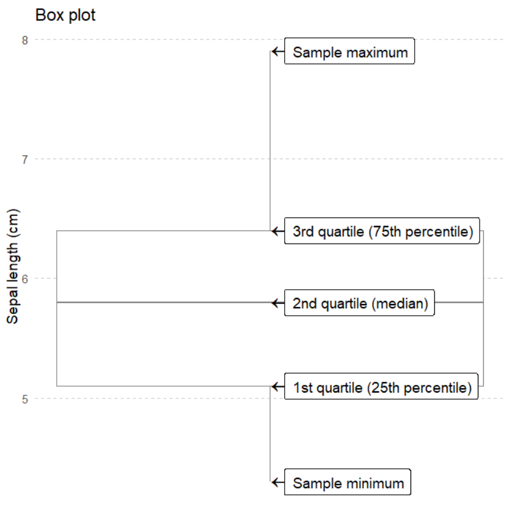
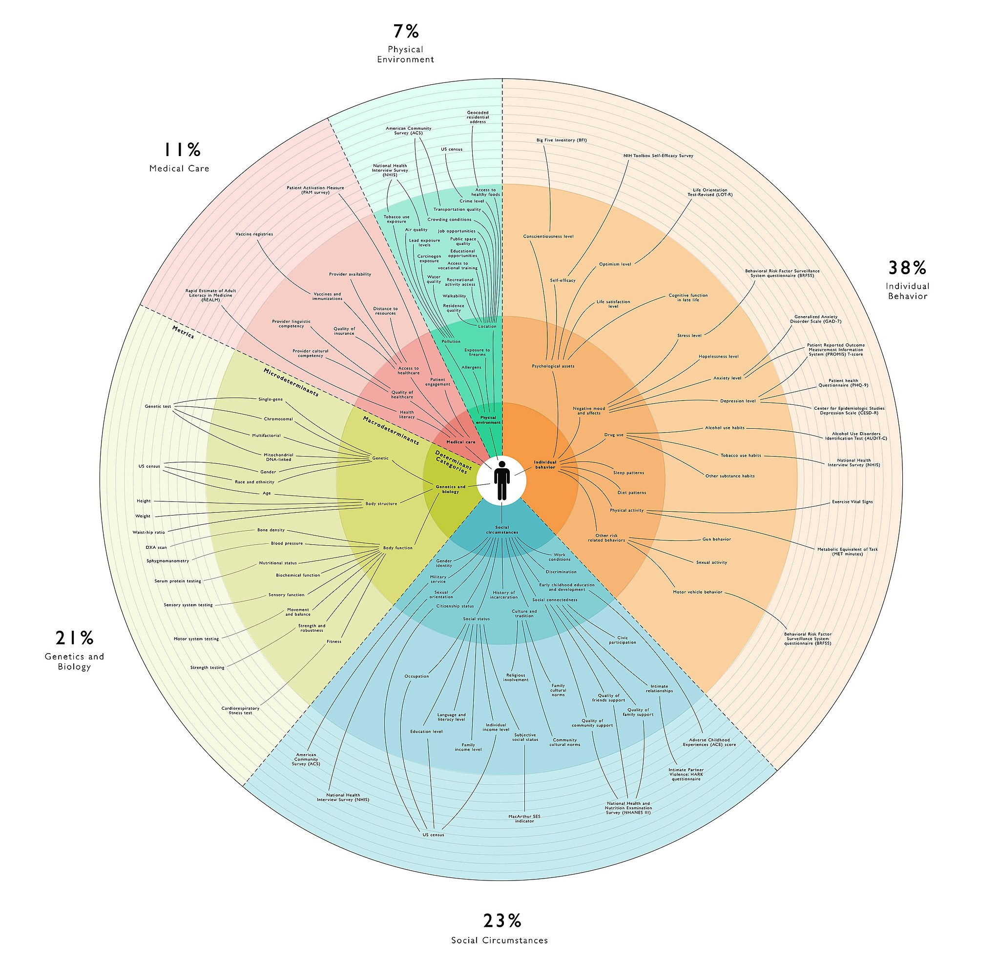

```{r setup, include=FALSE}
knitr::opts_chunk$set(echo = FALSE, warning=FALSE, message=FALSE)
options(htmltools.dir.version = FALSE)
library(ggplot2)
library(dplyr)
library(learnr)
library(cowplot)
library(NHANES)
library(rlang)
library(fivethirtyeight)
library(dataLiteracyTutorial)
library(skimr)
library(visdat)
data("NHANES")
theme_set(theme_classic())
theme_update(text=element_text(size = 13)) 
data("bmi_diabetes",package = "dataLiteracyTutorial")
```

## Learning Objectives

+ Explore how we can represent different kinds of data
+ Communicate with visualizations
+ Articulate when visualizations are misleading

### Remember

Be patient, curious, and ask questions. You can do this!

### Why Visualization?

Visualization is good for exploring data because we are really good at evaluating data visually.

+ We need to become aware of patterns in the data.
+ Sometimes these patterns are desirable:
    + Associations


http://www.ph.ucla.edu/epi/snow/mapsbroadstreet.html

### Undesirable Variation

+ Sometimes they are not desirable:
    + Experimental Artefacts

Why are there spikes in the data here?


http://care.diabetesjournals.org/content/30/8/1959


### How we measure blood pressure

Any thoughts after looking at this?


https://commons.wikimedia.org/w/index.php?curid=7050866

### Lots of Ways to Represent Data Visually

This is an non-exhaustive list of visualizations. We won't talk about all of these, as some of them are very specialized. 

This graphic is mostly to show you that there are lots of ways to visualize data, and which one you use is dependent on what parts of the data you want to emphasize.


### What a graph needs

+ Title (what it represents)
+ Labeled Axes (with units, preferably)
+ Variables and how they are represented
+ Scales
    + Is it a count or is it a proportion?
- How many variables and their types
    - Including ones used to dictate colors, shapes, patterns, sizes, opacities, etc.
    - Independent ("*predictor*") variables (e.g. time) are usually on the X (horizontal) axis
        - Occasionally time is plotted on the vertical axis for specific reasons
    - Dependent ("*outcome*" / "*response*") variables are usually on the Y (vertical) axis

```{r echo=FALSE}
NHANES %>% ggplot(aes(x=Weight,y=BMI)) + geom_point() + stat_smooth(method="lm",se = FALSE) + ggtitle("Weight vs. BMI in NHANES study") 
```

## The Data (NHANES)

We're going to look at data from a study called [NHANES (National Health and Nutrition Examination Survey)](https://www.cdc.gov/nchs/nhanes/about_nhanes.htm). 

This survey is meant to represent the United States (via a complicated sampling design) in terms of nutritional habits, physical activity, drug use, and outcomes (depression, diabetes, and physical activity).

### What does the data actually look like?

Here are the first 10 rows of the data table. Each row of the data corresponds to a patient. Each column is called a *variable* (if you look at the top of the table, you can get extra information about what data type that variable is).

```{r echo=FALSE}
bmi_diabetes[1:10,]
```

```{r datatable, echo=FALSE}
question("How many patients have High BMI (BMIstatus = `High`) and are Male (Gender = `Male`) from these first 10 rows?",
  answer("There are 3 patients.", correct=TRUE, message="Correct. There are 3 patients who have high BMI and are male."),
    answer("There are 4 patients.", message="Not quite. Go back and count."),
  answer("There are 5 patients.", message="Not quite. Go back and count."),
  allow_retry = TRUE, random_answer_order = TRUE
)
```

### Summarizing Data

Oftentimes, we'll have so many rows of the data (sometimes even 1 million rows!), that it's impossible to look at it all in a table. 

For this reason, we often try to generate *summaries* of the data to give us an idea of what is in the data.

Let's take a look at two types of summaries of the data. The first is a visual summary of the data.

Each *line* of this summary corresponds to a row in the dataset. You can see whether each row is *complete* (whether it has entries for each variable), or whether data is *missing*, which is represented as grey lines, and shows up as `NA` in the data.

Understanding why the data is missing is a really important part of being a data scientist. We'll look into more missing values in our next session.

```{r visdat, echo = FALSE}
visdat::vis_dat(bmi_diabetes) + ggtitle("Visual Summary of BMI/Diabetes Data")
```

```{r visdat_question, echo=FALSE}
question("How many categorical (also called factor) variables are there?",
  answer("There are 3 categorical variables.", correct=TRUE, message="Correct. The categorical variables are Diabetes, Gender, and BMIstatus."),
    answer("There are 2 categorical variables.", message="Not quite. Go back and count."),
  answer("There is one categorical variable.", message="Not quite. Go back and count."),
  allow_retry = TRUE
)
```

The second is a more tabular summary where we can get more information about the different variables.

```{r message=FALSE, warning=FALSE, echo=TRUE}
summary(bmi_diabetes)
```

```{r summary, echo=FALSE}
question("What can we learn from this summary table?",
  answer("The smallest BMI value is 15.", correct=TRUE, message="Correct!"),
  answer("There are two variables", message="Not quite. There's `outcome`, `smoker`, and `age`."),
  answer("You are considered as having diabetes versus not having diabetes", correct=TRUE, message="Yes, that's correct!"),
  answer("The age range of the patients includes minors.", message="Incorrect. Look at the min value for age."),
  answer("The average age of the participant was around 47 years of age", correct="Yes, the mean age was 46.92 years of age. Yes, you can see it as the mean value for the age" ),
  allow_retry = TRUE
)
```

## Categorical (or factor) Data

Categorical data has a limited number of possible values. Some examples include: your *home state* (50 possible values), *country of birth*, what kind of phone you have (iOS/Android).

### Let's look at Diabetes in our patients

One tool we often use to explore the data is a `table`, which counts how much of each category is there. Which group is larger?

```{r echo = TRUE}
table(bmi_diabetes$Diabetes)
```

Here's another way to look at the data, a bar plot. You can instantly see which of the groups is larger.

```{r echo=TRUE}
bmi_diabetes %>% tidyr::drop_na() %>% ggplot(aes(x=Diabetes)) + geom_bar() + ggtitle("Summary of Patients: Diabetes Status")
```

Sometimes it is easier to look at a table, but usually a bar chart will make things more obvious.

### Stacked Barplots

We can also stack values on top of each other to make a stacked barplot. This can be useful when comparing categories.

```{r echo=FALSE}
bmi_diabetes %>% tidyr::drop_na() %>% ggplot(aes(x=factor(1), fill=Diabetes)) + geom_bar(width=1, position = "stack", color="black") +  theme(axis.title.x = element_blank(),
    axis.ticks = element_blank(),
    axis.text.x = element_blank()) + ggtitle("Stacked Barplot of Diabetes Status")
```

### Look at the scale

What does the y-axis represent in each of these graphs?

```{r echo=FALSE, fig.width=7}
plot1 <- bmi_diabetes %>% tidyr::drop_na() %>% ggplot(aes(x=factor(1), fill=Diabetes)) + geom_bar(width=1, position = "stack", color="black") +  theme(axis.title.x = element_blank(),
    axis.ticks = element_blank(),
    axis.text.x = element_blank()) + ggtitle("Counts of Diabetes Patients")

plot2 <- bmi_diabetes %>% tidyr::drop_na() %>% ggplot(aes(x=factor(1), fill=Diabetes)) + geom_bar(width=1, position = "fill", color="black") +  theme(axis.title.x = element_blank(),
    axis.ticks = element_blank(),
    axis.text.x = element_blank()) + ggtitle("Proportions of Diabetes Patients")

cowplot::plot_grid(plot1, plot2)
```

### Stacked Barplots vs Pie Charts

Pie charts are ok for variables that just have two or three categories, but they become difficult to compare across two pie charts. 

Take a look at the barchart and pie chart. Which group (`male` or `female`) has the larger proportion of Diabetes patients? (Note that the scale has changed!)

```{r echo=FALSE}
outPlot <- bmi_diabetes %>% tidyr::drop_na() %>% ggplot(aes(x=factor(1), fill=Diabetes)) + geom_bar(position="fill",width=1, color="black") + facet_grid(".~Gender") + 
  
  theme(axis.title.x = element_blank(),
    axis.ticks = element_blank(),
        axis.title.y = element_blank(),
    axis.text.x = element_blank())

outPlot <- outPlot + ggtitle("Stacked Bar Plot comparing Diabetes by Gender")

outPlot

outPlot2 <- outPlot + coord_polar("y", start=0) + theme(
    axis.title.x = element_blank(),
    axis.title.y = element_blank(),
    panel.border = element_blank(),
    panel.grid = element_blank(),
    axis.ticks = element_blank(),
    axis.text.x = element_blank()
  )

outPlot2 <- outPlot2 + ggtitle("Pie Charts comparing Diabetes by Gender")

outPlot2
```

## Continuous Data

Now, let's look at how continuous (numeric) data can be represented.

### Histograms

A [histogram](https://en.wikipedia.org/wiki/Histogram) shows the distribution of a continuous variable by splitting it into bins and counting how many observations fall into each bin (left). 

You can think of a histogram as a bar graph where the x variable is numeric. 

```{r echo=FALSE}
set.seed(3)
data("bmi_diabetes",package = "dataLiteracyTutorial")

bmi_diabetes_small <- bmi_diabetes %>% dplyr::sample_n(size=200)

bmi_diabetes_small %>% ggplot(aes(x=BMI)) + 
  geom_histogram(bins = 10, fill="white", color="black") + 
  ggtitle("Histogram of BMI Values of NHANES Patients")
```

[Definition edited from Mikhail Popov](https://github.com/bearloga/wmf-allhands18)

### Histogram: Play with the Bins

To make a histogram, we have to bin the data, or convert the continuous data into ranges. 

Try adjusting the number of bins for the histogram. What details gets lost as you adjust the number of bins downwards?

```{r echo=FALSE}
sliderInput("hist_slider", "Number of Bins", min = 2, max=40, value = 15)
plotOutput("hist_plot")
```

```{r context="server"}
data("bmi_diabetes",package = "dataLiteracyTutorial")
set.seed(3)

bmi_diabetes_small <- bmi_diabetes %>% dplyr::sample_n(size=200)

output$hist_plot <- renderPlot(
  bmi_diabetes_small %>% ggplot(aes(x=BMI)) + 
    geom_histogram(bins = input$hist_slider, 
                   fill="white", color="black") + xlim(c(10, 85)) +
    ggtitle("Histogram of BMI")
)
```

### All the different ways to represent a continuous variable

Try out all the different ways you can represent a continuous variable in a distribution. Which one do you like?

```{r echo=FALSE}
selectInput("hist3_scale", label = "Select type of scale",choices = c("histogram", "density","boxplot", "violin", "dotplot", "box+violin"), selected="histogram")
plotOutput("cont1_plot")
```

```{r context="server"}
#load(here("data", "bmi_diabetes.rda"))

output$cont1_plot <- renderPlot({
outPlot <- bmi_diabetes_small %>% ggplot(aes(x=BMI)) 

bins <- 30

  if(input$hist3_scale =="histogram"){
    outPlot <- outPlot + geom_histogram(bins = bins, 
                                      fill="white", color="black")}
  if(input$hist3_scale == "density"){
    outPlot <- outPlot + geom_density()
  }

  if(input$hist3_scale == "boxplot"){
    outPlot <- outPlot + geom_boxplot(aes(y=BMI)) + coord_flip()
  }

  if(input$hist3_scale == "violin"){
    outPlot <- outPlot + geom_violin(aes(y=BMI)) + coord_flip()
  }

  if(input$hist3_scale == "dotplot"){
    outPlot <- outPlot + geom_dotplot(bins=bins, size=1)
  }

  if(input$hist3_scale == "box+violin"){
    outPlot <- outPlot  +   
      geom_violin(aes(y=BMI), adjust=0.5) + 
      geom_boxplot(aes(y=BMI), width=0.2) + 
      coord_flip()
  }

  outPlot <- outPlot + xlim(c(10, 85))
  
  outPlot
})
```

### Something weird about age

Let's look at our other continuous covariate, `Age`. Does the dotplot show anything weird to you?

```{r}
bmi_diabetes_small %>% ggplot(aes(x=Age)) + geom_dotplot(size=1) + xlim(c(21, 90)) + ggtitle("Dotplot of Age of Patients")
```

## Relationships: 2 categorical variables

Now we're going to delve into ways of visualizing the relationships between two categorical variables.

### Association

```{r echo = FALSE}
data("bmi_diabetes",package = "dataLiteracyTutorial")
set.seed(3)
bmi_diabetes_small <- bmi_diabetes %>% dplyr::sample_n(size=200)

bmi_diabetes_small %>% select(BMIstatus, Diabetes) %>% table()
```

### Proportional versus Frequency

Change the barplot type from `regular` to `proportional`. What changes? (look at the scale before/after).

Which barplot type helps you answer the question: "Is there a larger proportion of people with Diabetes with High BMI compared to those who have a low BMI?"

Which barplot helps you understand how many people had Diabetes with low BMI?

```{r echo = FALSE}
selectInput("bar_control1", "Select type of Barplot", choices=c("proportional", "regular"), selected="regular")
plotOutput("bar_1")
```

```{r context="server"}
output$bar_1 <- renderPlot({
  
  outPlot <- bmi_diabetes_small %>% filter(!is.na(BMIstatus)) %>% ggplot(aes(x=BMIstatus, fill=Diabetes))
  
  if(input$bar_control1 == "regular"){
    outPlot <- outPlot + geom_bar(position="stack", color="black") +
      ggtitle("Barplot of BMIstatus versus Diabetes")
  }
  
  if(input$bar_control1 == "proportional"){
    outPlot <- outPlot + geom_bar(position="fill", color="black") + ggtitle("Proportional Barplot of BMIstatus versus Diabetes")
  }
  
  outPlot
})

```

## Relationships: 1 categorical, 1 continuous

Now we're going to investigate the relationship between one variable that is continuous and another variable that is categorical.

### Quick Review of Mathematical Terms

Make sure you understand the following terms before you go on. [Here's a quick review in case you need it.](https://www.verywellmind.com/how-to-identify-and-calculate-the-mean-median-or-mode-2795785)

- *percentile* 
- *median*
- *mean* 

### Boxplots

When you are trying to understand the relationship between a continuous variable and a categorical variable, you want to use a boxplot.

A [boxplot](https://en.wikipedia.org/wiki/Box_plot) allows you to visually compare the distributions by way of a [five number summary](https://en.wikipedia.org/wiki/Five-number_summary) which includes:

- Sample minimum (the smallest value)
- First [quartile](https://en.wikipedia.org/wiki/Quartile) (*Q<sub>1</sub>*) which is the 25th percentile
- Second quartile (*Q<sub>2</sub>*) also known as the [*median*](https://en.wikipedia.org/wiki/Median). By definition, this is the middle of the data - 50% of the data is above this value and 50% is below this value.
- Third quartile (*Q<sub>3</sub>*) which is the 75th percentile
- Sample maximum (the largest value)
- Outliers (very large or small values) are represented as dots.



```{r boxplot, fig.height=7, fig.width=7, out.width=500, echo=FALSE, eval=FALSE}
five_number_summary <- iris %>%
  group_by(1) %>%
  summarize(
    `Sample minimum` = min(Sepal.Length),
    `1st quartile (25th percentile)` = quantile(Sepal.Length, 0.25),
    `2nd quartile (median)` = median(Sepal.Length),
    `3rd quartile (75th percentile)` = quantile(Sepal.Length, 0.75),
    `Sample maximum` = max(Sepal.Length)
  ) %>%
  tidyr::gather(Summary, Sepal.Length, -1) %>%
  select(-1)
ggplot(data = iris, aes(y = Sepal.Length, x = 1)) +
  geom_boxplot(color = "gray50") +
  geom_point(data = five_number_summary, size = 9, shape = "←", position = position_nudge(x = 0.025)) +
  geom_label(
    data = five_number_summary,
    aes(label = Summary, hjust = "left"),
    nudge_x = 0.025, size = 5, label.padding = unit(0.5, "lines")
  ) +
  theme_minimal(14) +
  labs(y = "Sepal length (cm)", title = "Box plot", x = NULL) +
  theme(
    panel.grid.major.y = element_line(linetype = "dashed", color = "gray80"),
    panel.grid.minor.y = element_blank(),
    panel.grid.major.x = element_blank(),
    panel.grid.minor.x = element_blank(),
    axis.text.x = element_blank()
  )
```
[Example and definition modified from Mikhail Popov](https://github.com/bearloga/wmf-allhands18)

### Understanding Boxplots

Try the different categorical variables out in the data. Is there a difference in medians between the categories? Is that difference meaningful?

```{r echo=FALSE}
selectInput("boxplot1_selection", "Select Categorical Variable", choices = c("Diabetes", "Gender"), selected ="Diabetes")
plotOutput("boxplot1")
```

```{r context="server"}
output$boxplot1 <- renderPlot({
  
  type_of_plot <- paste("Boxplot of BMI by", input$boxplot1_selection)
  
  bmi_diabetes_small %>% ggplot(aes_string(x=input$boxplot1_selection, y="BMI", fill=input$boxplot1_selection)) +
    geom_boxplot() + ggtitle(type_of_plot)
})
```

```{r boxplot2, echo=FALSE}
question("Is there a difference between median BMI between those that have diabetes that those who dont?",
         answer("no, there isn't a difference", message=""),
         answer("yes, but the difference is small", message = "You're on the right track. Take a look at the categorization of BMI"),
         answer("yes, and the difference is big", correct = TRUE),
         random_answer_order = TRUE, allow_retry = TRUE)
```

### Boxplots do lose some detail

Take a look at the boxplot and the violin plot side by side. What do you notice?

```{r echo=FALSE}
  boxp <- bmi_diabetes_small %>% ggplot(aes(x=Diabetes, y=BMI, fill=Diabetes)) +
    geom_boxplot() + ggtitle("Boxplot of BMI by Diabetes Status")

  viop <- bmi_diabetes_small %>% ggplot(aes(x=Diabetes, y=BMI, fill=Diabetes)) +
    geom_violin() + ggtitle("Violin plot of BMI by Diabetes Status")

  cowplot::plot_grid(boxp, viop)

```


## Relationships: 2 continuous variables

### Scatterplots

Scatterplots show the relationship between two continuous variables. We can add what's called a `fit line` between the two variables. Ideally, we want to see a line that is diagonal as possible. A flat line means there is no association between variables.

In this case, we are showing that knowing the values of one variable (`Weight`) means that you know something about another variable (`BMI`). Anyone know why?

```{r echo=FALSE}
NHANES %>% ggplot(aes(x=Weight,y=BMI)) + 
  geom_point() + stat_smooth(method="lm",se = FALSE) +
  ggtitle("NHANES patients: BMI versus Weight")
```

### Look at the relationship between continuous variables

Now you can try to get a feel for what correlation (linear and non-linear) looks like. Try a few pairs, such as (`BMI` and `Total Cholesterol`), (`BMI` and `Testosterone`), and (`Height`, `Income`).  Before you look at the data, make a guess whether there is a relationship between variables.

Do you see a relationship between these two variables? How strong is the relationship?

```{r}
cont_vars = c("Age","Weight","Height","BMI","Total Cholesterol"= "TotChol","Income"= "HHIncomeMid","Testosterone")

selectInput("select_x", "X-axis", choices = cont_vars,
            selected = "Weight")
selectInput("select_y", "Y-axis", choices = cont_vars,
            selected = "BMI")
plotOutput("scatterPlotCont")
```

```{r context="server"}
## taken from DSIExplore package - code by Jessica Minnier

# should wrap this into the package and not repeat like this
# need to figure out a better way to use quoted vs quosures
plot_w_cor_quotes = function(df,cont_x,cont_y) {
  enquo_x = quo(!! sym(cont_x))
  enquo_y = quo(!! sym(cont_y))
  #enquo_color = quo(!! sym(color))
  tmpdat =  df%>%summarize(x=mean(range(!!enquo_x,na.rm=T)),
                           y=max(!!enquo_y,na.rm=T),
                           cortext=paste("Pearson's r = ", round(cor(!!enquo_x, !!enquo_y,use="complete.obs"), digits = 2),
                                         "\nSpearman's r = ", round(cor(!!enquo_x, !!enquo_y,use="complete.obs",method="spearman"), digits = 2))
  )
  df %>% ggplot(aes_(x=enquo_x,y=enquo_y)) + geom_point() + stat_smooth(method="lm",se = FALSE) #+ 
    #geom_text(data = tmpdat,aes(x=x,y=y,label=cortext),inherit.aes = FALSE,size=4)
}

  output$scatterPlotCont <- renderPlot({
    
      output_title <- paste(input$select_x, "vs.", input$select_y)
    
    
      NHANES %>% plot_w_cor_quotes(input$select_x,input$select_y) +
        ggtitle(output_title)
      })

```
[Code adapted from DSIExplore by Jess Minnier](https://github.com/laderast/dsiexplore)

## Relationships: 1 variable versus time

### Time Series

Time series data is everywhere. We are often interested in looking at overall trends over time, or differences in trends over time.

Many types of clinical data can be represented as time series:

- Lab Information
- Patient Visits
- Nursing Shifts

We might be interested in questions of volume (is the number of visits to the emergency room increasing over time?), or whether a treatment for a patient shows improvement or not (does taking Blood Pressure Medicine improve our blood pressure after two weeks?).

The data below are the counts of major categories of crimes by month/year from Portland Police. Before we visualize the data, here are the first few rows of the dataset:

```{r}
data("crime_data_stat", package="dataLiteracyTutorial")

head(crime_data_stat)
```

[Line charts](https://en.wikipedia.org/wiki/Line_chart) are the most common way to visualize [time series](https://en.wikipedia.org/wiki/Time_series) data, with time **usually** as the horizontal X axis and range of a quantitative variable as the vertical Y axis. Try mousing along a line - you will get more information about each data point.

If the graph is too cluttered for you, try clicking on the legend to remove traces.

```{r}
plot <- crime_data_stat %>% ggplot(aes(x=crime_yearmonth, y=count, color=offense_category)) + geom_line() + ggtitle("Line Chart of Portland Crimes by month/year")

plotly::ggplotly(plot)
```

```{r crime_line, echo=FALSE}
question("What is the largest category of crime overall?",
  answer("Larceny Offenses.", correct=TRUE, message="Correct. There appears to be around 2000 of these crimes a month"),
    answer("Sex Offenses.", message="Not quite. Sex Offenses are the lowest"),
  answer("Motor Vehicle Theft.", message="Not quite. These are around 500 crimes a month."),
  allow_retry = TRUE
)
```

This is another plot called a *stacked-area* plot. This plot shows the cumulative numbers, and can be useful in showing how the total number of something is increasing or decreasing over time.

```{r}
plot <- crime_data_stat %>% ggplot(aes(x=crime_yearmonth, y=count, fill=offense_category)) + geom_area() + ggtitle("Stacked Area Chart of\n Portland Crimes by month/year")

plotly::ggplotly(plot)
```

```{r crime_area, echo=FALSE}
question("Are the total number of crimes continually increasing over time?",
  answer("No.", correct=TRUE, message="The total number of crimes doesn't appear to be increasing over time, holding steady around 4000 crimes per month"),
    answer("Yes.", message="Hmmm. Can you see an overall upward trend over time?"),
  allow_retry = TRUE
)
```

Finally, we can do a *proportional stacked area* plot. Much like the proportional barplot, we can see whether the proportion of any one category increases or changes over time. 

Because there are multiple categories and the proportions are changing for each, it's really hard to tell overall trends for this data. 

```{r}
plot <- crime_data_stat %>% ggplot(aes(x=crime_yearmonth, y=count, fill=offense_category)) + geom_area(position="fill") + ggtitle("Proportional Stacked Area Chart\n of Portland Crimes by month/year")

plotly::ggplotly(plot)
```


## Spatial Data

Spatial data is rapidly becoming very important, as it allows us to summarize spatial differences.

The following data is from Biketown about where people rented their bikes. Here's what the data looks like as individual points. Note the location of each point (which corresponds to a bike rental) has two variables: Latitude and Longitude. 

```{r}
data("biketown_small", package="dataLiteracyTutorial")
head(biketown_small)
```

The data can be *aggregated* by neighborhood, if we have the *spatial boundaries* of each neighborhood. We can count the number of rentals within each boundary to summarize by neighborhood:

```{r}
data("port_bike_small", package="dataLiteracyTutorial")
head(port_bike_small)
```

Below is an interactive map of Portland and Biketown Rentals. The map can toggle between the points themselves and a *chloropleth*, which summarizes the data by the number of points within a smaller area of the map, in this case, by neighborhood.

Which is easier to summarize by neighborhood? What neighborhood has the largest number of bike rentals?

```{r}
library(sf)
library(leaflet)
#library(here)
data("port_bike",package = "dataLiteracyTutorial")
data("bike_points", package="dataLiteracyTutorial")
biketown2 <- biketown2[sample(nrow(biketown2), 1000),]

bins <- c(1, 200, 600, 1000, 2000, 5000, 10000, Inf)
pal <- colorBin("YlOrRd", domain = port_bike$num_rentals, bins = bins)

labels <- sprintf(
  "<strong>%s</strong><br/>Number Bike Rentals: %g",
  port_bike$NAME, port_bike$num_rentals
) %>% lapply(htmltools::HTML)


leaflet() %>% 
  addPolygons(fillColor = ~pal(num_rentals), weight = 2,
   opacity = 1, group = "neighborhoods",
   color = "white",
  dashArray = "3", label = labels,
  fillOpacity = 0.5, data=port_bike) %>% 
  addMarkers(data = biketown2, group="points") %>%
  addLegend(position="bottomleft", pal=pal, 
            group="neighborhoods", values=port_bike$num_rentals,      
            labFormat = labelFormat( prefix = "",  
                                     suffix = "", between = "-"),
            title= "Num Bike Rentals",
            opacity = 0.7) %>% 
  addTiles()  %>% 
  addLayersControl(
           baseGroups = c("points", "neighborhoods"),
           options = layersControlOptions(collapsed = FALSE)
         )


```

```{r biketown1, echo=FALSE}
question("What neighborhood has the largest number of bike rentals?",
  answer("Portland Downtown.", correct=TRUE, message="There are 12452 rentals in this neighborhood."),
    answer("Sabin Community Association.", message="Hmmm. Go back and count."),
  answer("Northwest District Association.", message=" It has a large number of rentals, but not quite the highest."),
  allow_retry = TRUE, random_answer_order = TRUE
)
```

Spatial data becomes extremely powerful when they are combined with other information. What if we asked questions about Asthma Incidence and Overall Levels of pollution?

In this example, location is clearly one *Social Determinant of Health*, and using spatial analysis to highlight inequities in populations is very exciting and may allow us to better address these heatlh inequities.


From https://upload.wikimedia.org/wikipedia/commons/thumb/1/16/Social_Determinants_of_Health_Infoviz.jpg/1068px-Social_Determinants_of_Health_Infoviz.jpg

## Example: Smoking, Death, and Age

### Smokers versus non-smokers

The following dataset represents a set of patients who for which we know their `outcome` (dead/alive), their `smoker` status (yes/no), and their `Age`.

Look at the plot very carefully before answering the question below:

```{r}
data("Whickham", package="dataLiteracyTutorial")

Whickham %>% ggplot(aes(x=outcome, fill=smoker)) + geom_bar(color="black", position="fill") + ggtitle("Proportional Barplot of\nSmoking Status versus Outcome")
``` 

```{r simpsons}
question("According to the data, if you are a smoker, are you more likely to live or not? Look at the proportion of smokers within alive and dead",
  answer("If you smoke, you are more likely to live than be dead", correct=TRUE, message="Good job! Yes, you looked at the data"),
  answer("If you smoke, you are more likely to be dead than live", message="Did you really look at the data? Answer the question for the data."),
  answer("There is no association between smoking and death.", message="Did you really look at the data? Answer the question for the data."),
  random_answer_order = TRUE,
  allow_retry = TRUE
)
```

The following is a plot of the outcome status versus the age of the patient in the dataset. Remember, you can click on the legend to remove traces on the graph.

```{r}
library(plotly)
outcome_age <- Whickham %>% 
  group_by(age, outcome) %>% 
  summarize(count = n()) %>% 
  tidyr::spread(key=age, value=count, fill=0) %>%
  tidyr::gather(key=age, value=count, -outcome) %>%
  mutate(age=as.numeric(age)) %>%
  ggplot(aes(x=age, y=count, color=outcome, fill=outcome)) +
  geom_line() + ggtitle("Outcome versus Patient Age")

ggplotly(outcome_age)
```

```{r simpsons_age}
question("What do you notice about the patients above the age of 75?",
  answer("There are no alive patients above 75.", correct=TRUE, message="Good job! Yes, you looked at the data"),
  answer("There are no dead patients above 75", message="Go back and look at the counts on the graph."),
  answer("There are equal proportions of alive/dead patients above 75.", message="Go back and look at the counts on the graph."),
  random_answer_order = TRUE,
  allow_retry = TRUE
)
```

### Relationship between age and smoking/outcome

Let's assess what happens with number of deaths as we remove older patients from the data.

Adjust the slider and see what happens to the proportion of smokers for each outcome group as we remove the older patients from the dataset.

```{r}
sliderInput("slidy", "Age Cutoff", min=min(Whickham$age)+1, max=max(Whickham$age)-1, value=c(84),step = 1)
plotOutput("distPlot")
```

```{r context="server"}
  output$distPlot <- renderPlot(
      exMelt() %>% ggplot(aes(x=outcome, fill=smoker)) + geom_bar(position="fill", color="black") +ggtitle("The Effect of Age Cutoff on Smoking/Outcome")
      )
    
    exMelt <- reactive({
      cutoff = min(input$slidy)
      Whickham %>% filter(age < cutoff) %>% mutate(status="allPatients")
        #mutate(AgeCat=factor(ifelse(age > cutoff, "older", NA))) 
    })
```


```{r simpsons3, echo=FALSE}
question("What happens to the proportion of dead people who smoke as we filter out those patients who are greater than 59 years of age?",
  answer("The proportion of dead people who smoke is larger than the proportion of alive people who smoke", correct=TRUE, message="Correct. The large number of older people in the data actually affected our previous conclusions, because they were all dead."),
  answer("The proportion of dead people who smoke is equal to the proportion of alive people who smoke", message="Not quite."),
  allow_retry = TRUE
)
```


```{r simpsons_conclusions}
question("What do we conclude about the data? Check all that is true",
  answer("For the entire dataset, it appears that smoking is associated with being alive.", correct=TRUE, message="Good job! Yes, you looked at the data."),
  answer("Older patients (60+ years) in the dataset tend to be more dead than alive.", correct=TRUE),
  answer("Younger patients smoke more than older patients", message="This may be true, but we haven't examined this association"),
  answer("If we exclude older patients, we see what we expect: that smoking is associated with death.", correct=TRUE, message="Yes, the older patients having a larger proportion of death that the younger patients actually changed the association."),
  allow_retry = TRUE
)
```

## Quiz Yourself


### Distributions of annual income

Take a look at the distributions of annual income graph here and compare 1960 to 2016.

https://flowingdata.com/2016/06/28/distributions-of-annual-income/

```{r distributions, echo=FALSE}
question("For healthcare practicioners, what is true about comparing income from 1960 to 2016?",
  answer("The maximum healthcare income is higher for 2016 to 1960", correct=TRUE, message="Yes, the highest paid income is over $200,000 for 2016, and the highest income for 1960 is about $170,000"),
  answer("In general, healthcare salaries have increased", message="Yes. True.", correct=TRUE),
  answer("Healthcare professionals like cats", message="That's nowhere in the graph!"), 
  allow_retry = TRUE
)
```

### Quiz Yourself: Looking at Multiple Categories

[The Bechdel Test](http://bechdeltest.com) is a test to determine whether women are represented fairly in movies. 

> The Bechdel Test, sometimes called the Mo Movie Measure or Bechdel Rule is a simple test which names the following three criteria: (1) it has to have at least two women in it, who (2) who talk to each other, about (3) something besides a man.

The following is a dataset where the proportions of each of these categories are tabulated for movies over a range of time.


```{r bechdel}
question("What does the black line in the middle of the graph represent?", 
         answer("It's just for show", message="Take a look at the colors"), 
         answer("Men versus Women", message="take a look at the legend again."),
         answer("The division between those movies that pass the test, and those that fail", correct = TRUE), allow_retry = TRUE)

question("Are there more movies in 2010-2013 that pass the test than those in 1970-1974?", 
         answer("Yes, there are more movies that pass the test",correct=TRUE), answer("No, there are not more movies that pass the test."), allow_retry = TRUE)
```
  
What about the subcategories, such as `Women only talk about men`? Is it easy or hard to see if they are changing with time?

### Did your senatorial vote predict your presidential vote?

Take a look at the scatterplot below. Each dot represents a state polled and their percentage Republican or Democrat. Is there a relationship between knowing the 2012 presidential results and the 2014 presidential results? 


```{r vote}
question("For the chart above, were voters presidential preference in 2012 correlated with their vote for senators in 2014?",
         answer("Yes, there's a strong correlation", correct = TRUE),
         answer("Yes, but it's a small correlation", 
                message="Look at the percentages. Is that a big effect or not?"),
         answer("No, there is no correlation.", 
                message="Take a look at the line. Is it on the diagonal?"))
```

## Misleading Visualizations: Visualization Lies

Not all visualizations are good. Some are just plain misleading.

Take a look at the following page. What do you think is the most decieving use of visualization?

https://flowingdata.com/2017/02/09/how-to-spot-visualization-lies/


## Take Home Points

- 2 categorical variables: barplots
- 1 categorical variable, 1 continuous variable: boxplots
- 2 continuous variables, scatterplots
- 1 variable versus time: lineplot/stacked area plots
- 1 variable versus location: marker map/chloropleth
- Need to understand what the graph is trying to communicate
- Not all graphs are good - people can use them to mislead

### Acknowledgements

Portions of this tutorial are partially adapted from:

- https://github.com/bearloga/wmf-allhands18
- https://github.com/laderast/dsiexplore

## Going beyond: Aesthetics

The following section is optional.

### Aesthetic Properties: Color

Beyond our basic plots, we might want to map different measurements to different visual properties.

For the 2x2 bar plots, we mapped Diabetes to *color*.

```{r echo=FALSE}
bmi_diabetes_small %>% filter(!is.na(BMIstatus)) %>% ggplot(aes(x=BMIstatus, fill=Diabetes)) + 
  geom_bar(position="fill", color="black")
```

For scatterplots, we might want to code categorical data as *color* like the example below:

```{r echo=FALSE}
bmi_diabetes_small %>% ggplot(aes(x=Age, y=BMI, color=Diabetes)) + geom_point() 
```

### Aesthetic Properties: Shape

Journals used to only allow black and white figures, so color couldn't be used. One alternative is mapping our `Diabetes` Variable to `shape`

```{r echo=FALSE}
bmi_diabetes_small %>% ggplot(aes(x=Age, y=BMI, shape=Diabetes, fill=Diabetes)) + geom_point() 
```


### Waterfall Plots (optional)

Another way to visualize the relationship between a continuous variable and a categorical variable is a waterfall plot. With a waterfall plot, we plot each continuous value as a single bar and sort them increasing value. Each bar is then colored by the categorical variable.

Each of these bars represents a person who smokes (Y/N) and their age. If you are older than 60, are you less likely to smoke?

```{r}

data("Whickham",package = "dataLiteracyTutorial")

Whickham %>% sample_n(size=50) %>% arrange(age) %>% mutate(row_num=1:nrow(.)) %>% ggplot(aes(x=row_num, y=age, fill=smoker)) + geom_bar(stat="identity")


```

Graph literacy
https://concord.org/wp-content/uploads/2016/12/pdf/teaching-graph-literacy-across-curriculum.pdf

